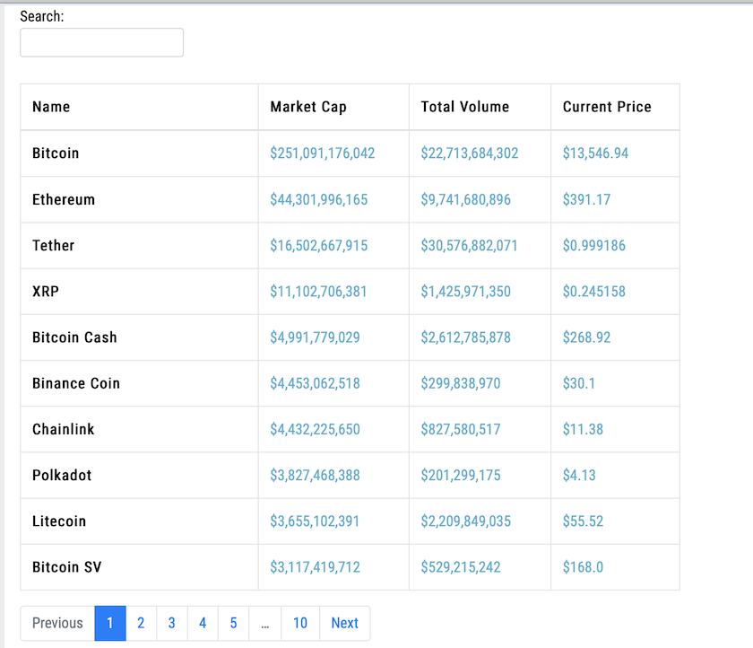

```

           _                       _       _               
          (_)                     | |     | |              
  ___ ___  _ _ __   __      ____ _| |_ ___| |__   ___ _ __ 
 / __/ _ \| | '_ \  \ \ /\ / / _` | __/ __| '_ \ / _ \ '__|
| (_| (_) | | | | |  \ V  V / (_| | || (__| | | |  __/ |   
 \___\___/|_|_| |_|   \_/\_/ \__,_|\__\___|_| |_|\___|_|   
                                                           
```

# About

Displays cryptocurrency information on webpage using using Django and CoinGeckoAPI 

# Installation
### Virtual Environment
* `python3 -m venv venv`
* `source venv/bin/activate`
* `pip3 install -r requirements.txt`
* `python manage.py runserver`

### Docker
* `docker build -t coin-watcher .`
* `docker run -i -t -p 8000:8000 coin-watcher python3 manage.py runserver 0.0.0.0:8000`

# Example
## Create an account and start adding coins to your portfolio !
<p>
  
</p>


